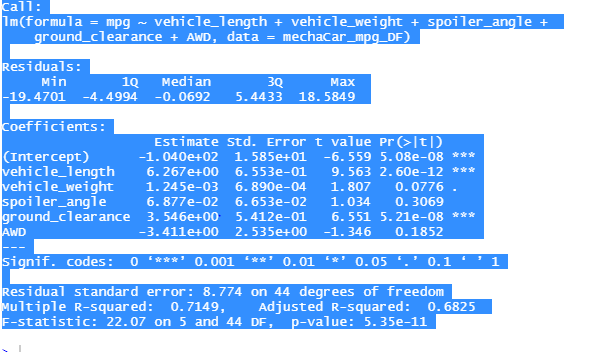
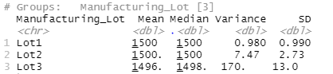
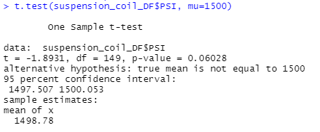
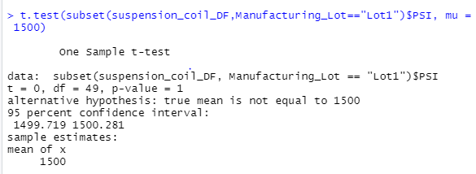
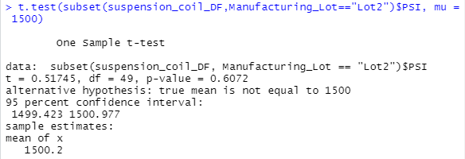
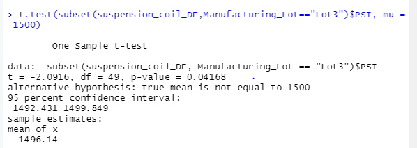

# MechaCar - Analysis for Improvement

AutosRUs’ newest prototype, the MechaCar, is suffering from production troubles that are blocking the manufacturing team’s progress. AutosRUs’ upper management has called on Jeremy and the data analytics team to review the production data for insights that may help the manufacturing team.

- Perform multiple linear regression analysis to identify which variables in the dataset predict the mpg of MechaCar prototypes
- Collect summary statistics on the pounds per square inch (PSI) of the suspension coils from the manufacturing lots
- Run t-tests to determine if the manufacturing lots are statistically different from the mean population
- Design a statistical study to compare vehicle performance of the MechaCar vehicles against vehicles from other manufacturers. For each statistical analysis, you’ll write a summary interpretation of the findings

## Linear Regression to Predict MPG 

Which variables/coefficients provided a non-random amount of variance to the mpg values in the dataset?

- vehicle_length, vehicle weight, spoiler_angle, ground clearance and AWD provided a non-random amount of variance. Out of these the most amount of random variance are "ground clearance" and "vehicle_length".

Is the slope of the linear model considered to be zero? Why or why not?

- The slope of the linear model can not be considered to be zero, as the p-value of `5.35x10-11`, has an  extremely low level of significance. Therefore, the null hypothesis must be rejected. 

Does this linear model predict mpg of MechaCar prototypes effectively? Why or why not?

- Our R-squared value is 71%, which means roughly ~71% of the time the model will predict mpg values correctly. So the model does predict with reasonable effectiveness. Although, there are probably other factors that were not captured in the dataset that contribute to the mpg variability of the MechaCar prototypes.

  

## Summary Statistics on Suspension Coils

​																	**Total Summary**

​																	**Lot Summary**

- The design specifications for the MechaCar suspension coils dictate that the variance of the suspension coils must not exceed 100 pounds per square inch. Does the current manufacturing data meet this design specification for all manufacturing lots in total and each lot individually? Why or why not?

  Lot 1 and Lot 2 are both within design specifications and have nearly the same exact mean and median. Lot 3 shows the most variance and is well over the acceptable threshold at 170.28 i.e. the manufacturers specs.

## T-Tests on Suspension Coils

The tests and findings are all listed below.

|  |
| ------------------------------------------------------------ |
| **All Manufacturing Lots** - Data gathered of this test - the T-test for  the suspension coils across all manufacturing lots, shows that they are not  statistically different from the population mean, and the p-value is not low  enough (0.06028) for us to reject the null hypothesis. |
|  |
| **Lot 1 -** A review of the results of the T-test for the  suspension coils for Lot 1 shows that there is not any statistically  different from the population mean. Besides, the p-value is not low enough (value  = 1) for us to reject the null hypothesis. |
|                                                              |
|  |
| **Lot 2  -** A review of the results of the T-test for the  suspension coils for Lot 1 shows that there is not any statistically  different from the population mean. Besides, the p-value is not low enough (value  = .6072) for us to reject the null hypothesis. |
|  |
| **Lot 3 -**  Results from the T-test for the suspension coils for Lot 3  shows that they are somewhat different from the population mean. Also, the  p-value is just low enough (value = 0.0417) to reject the null hypothesis.  This lot may be need to be discarded. Alternatively, it should be closely  monitored. |
|                                                              |

## Study Design: MechaCar vs Competition

There are many features that consumers are interested in a car. But, I think the horsepower of the car stands out among their top factors. Horsepower is the underlying factor for capacity in that vehicle and performance.

### What metric or metrics are you going to test?

To narrow down our tests, we should use MechaCar's horsepower of the engine in comparison to other competitor vehicles.

### What is the null hypothesis or alternative hypothesis?

MechaCar prototypes' horsepower is similar to competitor's vehicles in the same vehicle class and that there is no statistical difference. MechaCar prototypes' average horsepower is statistically above or below that of competitor vehicles.

### What statistical test would you use to test the hypothesis? And why?

Two sample t-tests would suffice for this. 

### What data is needed to run the statistical test?

We would need to gather horsepower data from the carrying compartments of all MechaCar prototypes, as well as from all major competitor vehicles.
